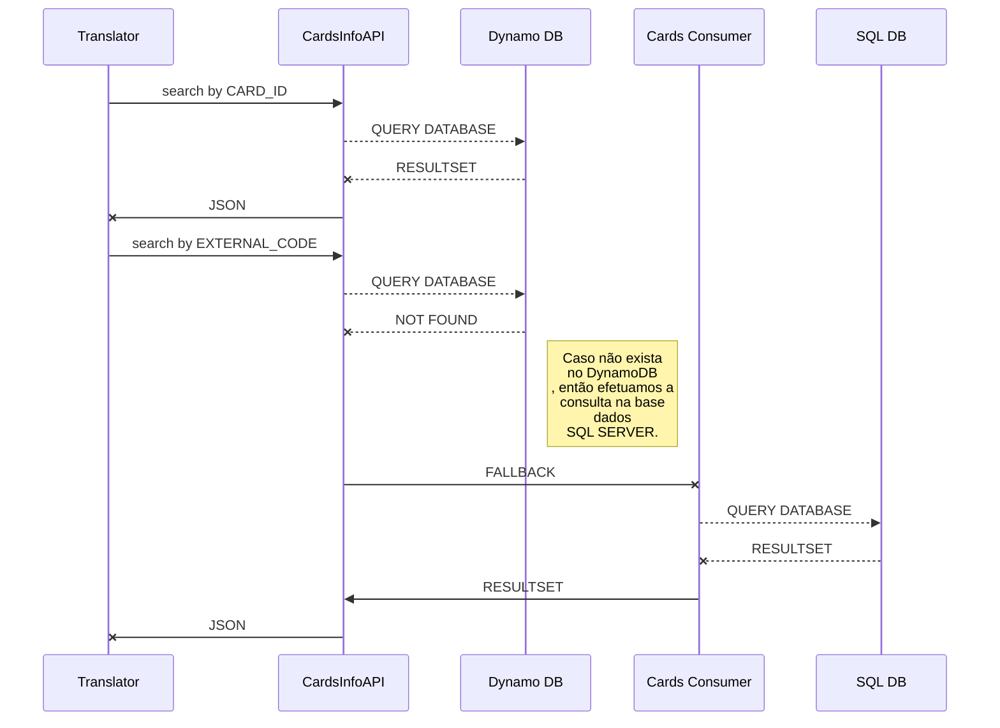
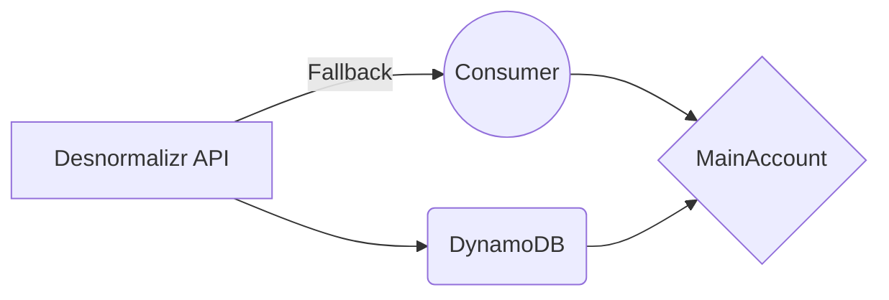

########################################################################
# Financial Operations API
## API Web para transações financeiras 
Esta API serve para criação e integração de operações financeiras
Este projeto é um dos componentes que fazem parte do projeto Financial.
> Você pode obter mais informações sobre o projeto  **Financial** , seus componentes e motivação [aqui](https://bitbucket.org/bjbraz_financial/transactions_api/src/master/).

## Tecnologias
- Kotlin 1.3.50
- Spring Boot 2.2.1.RELEASE
- WebFlux
- DynamoDB

## Requisitos dev
- Eclipse ou Intellij IDEA
- JDK 1.8

## Criando uma nova Branch
- Na pasta raiz, sempre que for criar uma nova feature
```bash
git checkout -b feature/featureName develop
```
-- Close Branchs after merge with develop


## Variáveis de ambiente necessárias

- AWS_REGION (Região da AWS utilizada)
- AWS_ACCESS_KEY_ID (Acesso aos serviços da AWS)
- AWS_SECRET_ACCESS_KEY (Acesso aos serviços da AWS)

## Como usar (dev)

- Na pasta raiz, executar:

```bash
docker-compose up --build
```

## Endpoints ativos
- [PUT] /accounts
- [PATCH] /accounts
- /accounts
- /actuator/health
- /card/{cardId}

## Variaveis de ambiente

- Garanta que as variáveis de ambientes da AWS estejam devidamentes atribuídas

```bash
export AWS_REGION=
export AWS_ACCESS_KEY_ID=
export AWS_SECRET_ACCESS_KEY=
```

## Construir imagem docker e subir no registry

- Na pasta raiz, executar:

```bash
docker build --network=host --build-arg aws_region= --build-arg aws_access_key_id= --build-arg aws_secret_access_key= -t alexjavabraz/bjbraz:<version> .
docker push alexjavabraz/bjbraz:<version>
```

## Modelo de Dados
Este projeto utilizará inicialmente a base de dados Dynamo DB, considerando o seguinte modelo de dados:

|INDICE_PK       |INDICE_SK|ACCOUNT_ID|CARD_ID|CONTRACT_ID|EXTERNAL_CODE|MAIN_ACCOUNT_ID|
|----------------|---------|----------|----------|----------|----------|----------|
|card_id|`"529960"`|1272|529960|486|`"xyz"`|846|
|card_id|`"529963"`|1281|529963|474|`"abc"`|780|
|external_code|`"abc"`|1281|529963|474|`"abc"`|780|
|external_code|`"xyz"`|1272|529960|486|`"xyz"`|846|

## UML diagrams

Este é o fluxo básico de atendimento das requisições pelo cards_information_api [transactions_api](https://bitbucket.org/bjbraz_financial/transactions_api/src/master/). Seguem as integrações da API de transações:






## Como gerar os testes e o html de cobertura

- Na pasta raiz, executar:

```bash
./mvnw verify
```

- Abrir o arquivo target/site/jacoco/index.html

## Como rodar a aplicação em modo DEV
- Na pasta raiz, executar com profile LOCAL:
```bash
mvn spring-boot:run -Dspring-boot.run.profiles=local -Dspring-boot.run.jvmArguments="-Xdebug -Xrunjdwp:transport=dt_socket,server=y,suspend=n,address=5005"
```

## Como consultar a versão atual da aplicação:
- Esta é a URL configurada para exibir a atual versão da aplicação:
```bash
http://localhost:8080/
```

## Acessar o swagger

```bash
http://localhost:8080/swagger-ui.html
```

## Como acessar o HealthCheck
- Esta é a URL configurada para o Actuator Healthcheck:
```bash
http://localhost:8080/actuator/health
```

## Como gerar os artefatos do sonarqube
- Na pasta raiz, executar (se atentar para variáveis de ambiente):
```bash
mvn clean test verify sonar:sonar \
-Dsonar.projectKey={APP_NAME} \
-Dsonar.host.url=http://sonar.hubfintech.com.br \
-Dsonar.java.codeCoveragePlugin=jacoco \
-Dsonar.jacoco.reportPath=.\\target\\coverage-reports\\jacoco-ut.exec \
-Dsonar.dynamicAnalysis=reuseReports \
-Dsonar.sourceEncoding=UTF-8 \
-Dsonar.sources=.\\src\\main\\java \
-Dsonar.tests=.\\src\\test\\java \
-Dsonar.java.binaries=.\\target\\classes \
-Dsonar.language=java \
-Dsonar.projectBaseDir=. \
-Dsonar.surefire.reportsPath=.\\target\\surefire-reports \
-Dsonar.login={APP_ID}
```

## Configuração MYSQL 8+ para amiente de desenvolvimento
```bash
mysql -u root -p
CREATE USER 'newuser'@'localhost' IDENTIFIED BY 'user_password';
CREATE USER 'newuser'@'%' IDENTIFIED BY 'user_password';
CREATE DATABASE financial;
GRANT ALL PRIVILEGES ON financial.* to 'newuser'@'%';
ALTER USER 'newuser'@'%' IDENTIFIED WITH mysql_native_password BY 'user_password';
FLUSH PRIVILEGES;
```

## Demais variáveis de ambiente

- ACCOUNT_INFO_CONSUMER_URL (URL base do Card Information Consumer; padrão em QA: `http://172.22.121.153:4013`)
- CARD_KEYS_TABLE_NAME (Tabela do DynamoDB para consulta de dados-chave ligados ao cartão; padrão: `cards_keys`)
- CARD_KEYS_PK_SK_INDEX (Nome do índice do DynamoDB para consulta da tabela acima via *partition_key* e *sort_key*; padrão: `indice_pk-indice_sk-index`)
- LOGGING_LEVEL (Nível de log da aplicação; padrão: `INFO`)
